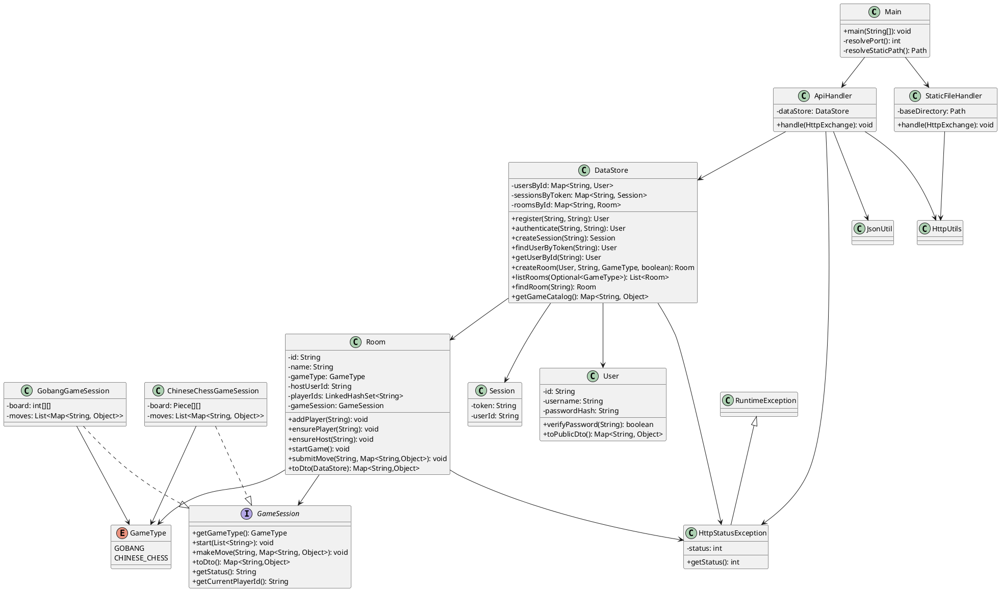
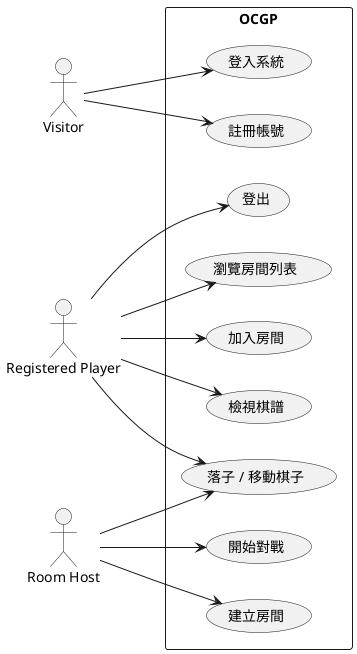
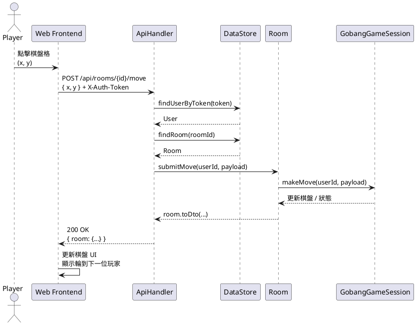

# 線上棋類遊戲平台 (OCGP) 系統說明文件

## 1. 專案概述

線上棋類遊戲平台（Online Chess Game Platform, OCGP）是一個提供多人即時對弈環境的全端應用程式。系統支援使用者註冊/登入、房間建立與管理、象棋與五子棋的規則運算，以及棋譜紀錄。前端以 HTML/CSS/JavaScript 建構單頁式介面，後端則使用 Java（`com.sun.net.httpserver.HttpServer`）實作輕量 REST API 與靜態資源伺服器。

## 2. 系統架構

- **前端 (frontend/)**  
  - `index.html`：入口頁面，包含登入、房間大廳與對局畫面區塊。  
  - `styles.css`：桌面優先的排版與棋盤呈現樣式。  
  - `app.js`：負責狀態管理、API 呼叫、棋盤互動與畫面更新。

- **後端 (backend/src/com/ocgp/server/)**  
  - `Main`：啟動嵌入式 HTTP server，註冊 API 與靜態資源路由。  
  - `ApiHandler`：解析 `/api` 路由，提供帳號、遊戲、房間相關的 RESTful 介面。  
  - `StaticFileHandler`：傳送前端靜態檔案。  
  - `DataStore`：記憶體內的資料儲存，管理使用者、Session、房間與對局狀態。  
  - `Room` 與 `GameSession`：定義遊戲房間與共通的對局介面。  
  - `GobangGameSession`、`ChineseChessGameSession`：分別實作五子棋與象棋規則。  
  - 公用類別：`JsonUtil`、`HttpUtils`、`HttpStatusException`、`GameType`、`StaticFileHandler` 等。

系統啟動後，所有請求預設服務在 `http://localhost:8080`：

- `/api/**`：進入 REST API，由 `ApiHandler` 處理。  
- `/` 及其他靜態資源路徑：由 `StaticFileHandler` 回應前端資源（若找不到檔案則回傳 `index.html` 作為 SPA fallback）。

## 3. 後端元件詳述

| 元件 | 職責摘要 |
| ---- | -------- |
| `Main` | 解析環境變數 `OCGP_PORT`、`OCGP_STATIC_DIR`，啟動 `HttpServer` 並設定路由。 |
| `ApiHandler` | 解析 HTTP 方法與路徑，進行身份驗證、對 `DataStore` 操作、回傳 JSON 回應。 |
| `DataStore` | 維護使用者、Session、房間與對局；處理註冊、登入、房間建立、玩家加入等邏輯。 |
| `Room` | 封裝房間狀態（玩家、遊戲類型、是否開始）並委派 `GameSession` 處理對局。 |
| `GameSession` | 介面，定義 `start`、`makeMove`、`toDto` 等方法供不同棋種實作。 |
| `GobangGameSession` | 維護 15x15 棋盤、檢查連五、控制輪到誰行棋。 |
| `ChineseChessGameSession` | 建立 9x10 棋盤，遵循象棋棋子移動與「將不見面」規則。 |
| `JsonUtil` | 最小化 JSON 解析與序列化工具，支援基本型別、物件與陣列。 |
| `HttpUtils` | 產生 JSON/文字回應，設定 CORS 標頭，統一回應格式。 |

### 3.1 REST API 摘要

| Method | Path | 說明 | 身份驗證 |
| ------ | ---- | ---- | -------- |
| POST | `/api/register` | 註冊新帳號並回傳 token | 否 |
| POST | `/api/login` | 使用帳密登入並回傳 token | 否 |
| GET | `/api/me` | 回傳目前登入使用者資訊 | 需 `X-Auth-Token` |
| GET | `/api/games` | 取得支援棋種清單 | 否 |
| GET | `/api/rooms` | 取得公開房間列表（僅回傳 private=false 房間），可用 `gameType` 篩選 | 否 |
| POST | `/api/rooms` | 建立新房間 | 是 |
| GET | `/api/rooms/{id}` | 查看特定房間詳細狀態 | 是（必須帶 X-Auth-Token） |
| POST | `/api/rooms/{id}/join` | 加入房間 | 是 |
| POST | `/api/rooms/{id}/start` | 房主開始對局 | 是（房主限定） |
| POST | `/api/rooms/{id}/move` | 提交一步棋（象棋或五子棋） | 是 |
| POST | `/api/rooms/{id}/leave` | 離開房間；若房間變成空房（0 人）則排程 30 秒後刪除（期間有人 /join 會取消刪除） | 是 |
| POST | `/api/rooms/{id}/restart` | 房主於對戰結束後重置對局（回到等待開始，可再次 start） | 是（房主限定） |

所有需要驗證的 API 必須在請求標頭帶入 `X-Auth-Token`。

## 4. 前端行為概述

- **狀態管理**：`app.js` 使用全域 `state` 物件保存 token、使用者資料、遊戲清單、房間列表、當前房間與定時輪詢器。  
- **登入/註冊流程**：提交表單後呼叫對應 API，成功時儲存 token 至 `localStorage` 並進入大廳。  
- **房間列表**：初始化時載入遊戲種類與公開房間，於前端排序與渲染列表，已加入或正在進行的房間會顯示不同按鈕狀態。  
- **房間內互動**：進入房間時啟動輪詢，每 2.5 秒抓取最新狀態；提供房主開始對局按鈕；展示玩家列表、棋盤、歷史步驟。  
- **棋盤互動**：  
  - 五子棋：依照玩家當前是否輪到自己決定格子是否可點擊。  
  - 象棋：採雙擊/點兩下方式選取棋子與目標格，透過視覺高亮提示。
- **五子棋 hover 預覽**：當輪到玩家下棋時，滑鼠移動到可落子空格會顯示半透明棋子作為預覽提示。
- **象棋視角一致性**：象棋棋盤會依玩家身份調整視角，確保己方棋子固定在畫面下方、對方棋子在上方；操作時前端會自動轉換座標以符合後端棋盤座標系。


### 空房刪除策略

- 當最後一位玩家呼叫 `POST /api/rooms/{id}/leave` 後，若房間人數變為 0：
  - 後端不會立刻刪除，而是排程 **30 秒後刪除**。
  - `leave` 會回傳：`{ "scheduledDeletion": true, "ttlSeconds": 30 }`。
- 若在 30 秒內有人呼叫 `POST /api/rooms/{id}/join`：
  - 後端會取消刪除排程，房間會保留。

### 對局中離開處理

- 若任一玩家在對局進行中呼叫 `POST /api/rooms/{id}/leave`：
  - 後端會將房間狀態回復為等待開始（`started=false`，`status=WAITING`，`gameState=null`）。
  - 目的為避免輪到已離開玩家導致對局卡死。
- 若房主離開且房間仍有玩家：
  - 房主身分會轉移給剩餘玩家中的第一位。


## 5. 典型作業流程

1. 訪客透過 `/api/register` 建立帳號或 `/api/login` 登入，取得 `X-Auth-Token`。  
2. 登入後進入大廳，載入可用棋種與公開房間列表。  
3. 玩家可以建立新房間或加入現有房間。房主在兩位玩家都進入後點選「開始對戰」。  
4. 系統初始化對局（依棋種建立 `GameSession`），輪流行棋並驗證每一步是否合法。  
5. 五子棋判定連線即結束。  
6. 象棋結束條件：
  - 吃掉對方將/帥 → 立即結束，行棋者獲勝。
  - 若輪到對手但其 **不存在任何合法行棋**（包含被將死或困斃）→ 對局結束，上一手行棋者獲勝。
7. 遊戲過程中記錄每一步棋與狀態，供前端顯示。

## 6. UML 圖（PlantUML）

### 6.1 類別圖



### 6.2 使用案例圖



### 6.3 序列圖（提交五子棋落子）



> 註：若提交非法棋步，`GameSession` 會拋出 `HttpStatusException`，API 以 4xx 回應錯誤訊息，前端顯示提示。

## 7. 部署與執行

### 7.1 前置需求

- Java JDK 17 以上（開發環境使用 Java 23）。  
- Windows PowerShell 或 CMD（可使用 `backend/run.ps1` 或 `backend/run.cmd`）；其他平台可使用對應 bash 指令。

### 7.2 快速啟動

```powershell
cd backend
.\run.ps1 -Port 8080
```

或使用 CMD：

```cmd
cd backend
run.cmd 8080
```

若使用 shell：

```bash
javac --add-modules jdk.httpserver -d backend/out $(find backend/src -name "*.java")
OCGP_PORT=8080 OCGP_STATIC_DIR="$(pwd)/frontend" \
  java --add-modules jdk.httpserver -cp backend/out com.ocgp.server.Main
```

### 7.3 測試建議

1. 於瀏覽器開啟 `http://localhost:8080`。  
2. 使用兩個瀏覽器視窗或隱私視窗建立不同帳號。  
3. 建立房間，邀請另一位玩家加入並開始遊戲。  
4. 驗證輪流落子、勝負判定、棋譜紀錄與 UI 更新。  
5. 可更換棋種為象棋，測試特殊走法（馬腿、炮架、士象限制等）。

## 8. 後續擴充方向

- 將記憶體資料改為永續化資料庫（例如 PostgreSQL）。  
- 增加聊天室、觀戰模式與棋譜匯出（PGN/SGF）。  
- 引入 WebSocket 提供即時推播，減少輪詢。  
- 支援更多棋種、AI 對弈、排名與戰績統計。  
- 新增自動化測試涵蓋 API 與遊戲規則。

---

以上文件提供系統結構、流程與 UML 圖示，與 PlantUML 程式碼可直接複製產出圖形，有助於日後維護與擴充。
